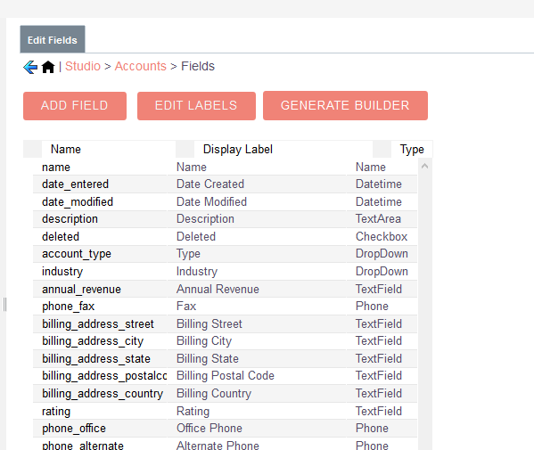

# suitecrm-beanbuilder

This plugin consists of two main parts, a classes with string constants of values from dropdown fields (enums, multienums) and classes implementing builder pattern for modules


* The "model classes" as I call them are classes containing string constants for values of enum fields which are intended to replace the usage of string literals when comparing values of dropdown fields or setting a value to a dropdown field of object (SugarBean)
	* Out-of-the-box, the plugin contains model class for each existing dropdown/multiselect field which exists in clean SuiteCRM installation. 
	* The model class is re-created each time when you modify the list of values for dropdown.
	* Naming convention - {ModuleName}{FieldName}.php e.g. AccountsAccount_type.php, TasksStatus.php, etc...


* Implementations of builder pattern are provided for out-of-the-box SuiteCRM modules 
	* Plugin also has action integrated into Studio which generates a builder class for a module.
	* Wether you have created a custom module, or you're adding custom fields to existing modules you can generate a builder class. 


## Download

Download is avaliable at the SuiteCRM Store: https://store.suitecrm.com/addons/suitecrm-beanbuilder

## Installation

* Plugin is installed via Module Loader
* The builder pattern classes will reside in ``custom/include/beanbuilder/builders``
* The model classes will reside in ``custom/include/beanbuilder/model``

## Usage in code

### Model class

```php
require_once 'custm/include/beanbuilder/model/Accounts/AccountsAccount_type.php'
...

//we want to check that the account type is Analyst

if($account->type == AccountsAccountType::ANALYST){
	// do something cool
}

...

```

### Builder class

Usage in logic hook method:

```php
require_once 'custom/include/beanbuilder/builders/AlertsBuilder.php';


class MyCoolLogic 
{

function myCoolBeforeSave($bean, $event, $arguments){

	$alertBuilder = new AlertsBuilder();
	//Here we also see an example of using model class for setting the value of alert type
	$alertBuilder->name('new alert')->description('alert created with builder class')->assignedUser(1)->targetModule('Accounts')->type(AlertsType::INFO);
	$alert = $alertBuilder->build();
	$alert->save();
}

}

```

## Generating a new builder class

Navigate: Administration > Studio > Accounts > Fields > Generate builder


